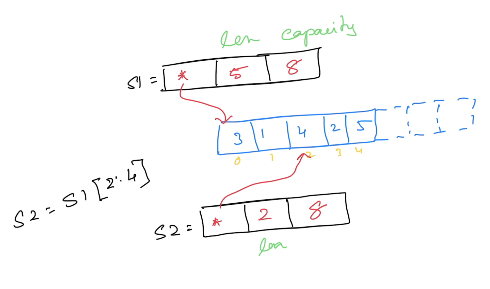
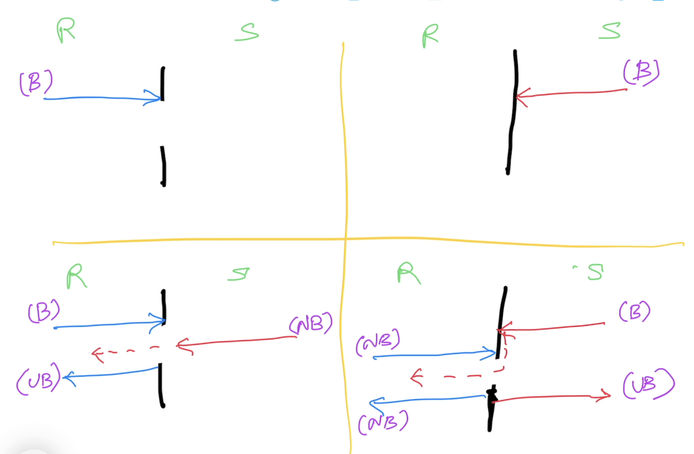

# Golang

## Magesh Kuppan
- tkmagesh77@gmail.com
- 99019-11221

## Schedule
| What | When |
|------|------|
| Commence | 9:00 AM |
| Tea Break | 10:30 AM (20 mins)|
| Lunch Break | 12:30 PM (1 hour) |
| Tea Break | 3:00 PM (20 mins) |
| Wind up | 5:00 PM |

## Methodology
- No powerpoint presentation
- Discussion & Code

## Repository
- https://github.com/tkmagesh/WellsFargo-Go-Jan-2026


# Day-01 
## Why Go?
- Simplicity
    ONLY 25 keywords
    - No access modifiers (private/public/protected)
    - No reference types (Everything is a value by default)
    - No pointer arithmatic
    - No class (Only structs)
    - No Inheritance (Only composition)
    - No Exceptions (Only errors)
    - No try..catch..finally
    - No implicit type conversions
- Performance
    - On par with C++
    - Close to the hardware
        - Compiled to machine code
- Concurrency
    - Cheap & Efficient


## Program Structure
### Compilation
```shell
go build <filename.go>

# To create a binary in a different name
go build -o <binary_name> <filename.go>
```

### Cross Compilation
#### To get the list of supported platforms
```shell
go tool dist list
```

#### To list all the environment variables (go tool)
```shell
go env
```

#### To list specific environment variables
```shell
go env <var_1> <var_2> ....
```

#### To change the env variables
```shell
go env -w <var_1>=<new_value_1> <var_2>=<new_value_2> ...
```

#### Cross Compile (mac/unix/linux)
```shell
GOOS=<target_os> GOARCH=<target_arch> go build <filename.go>
```

#### In windows (powershell)
```powershell
$env:GOOS="windows"; $env:GOARCH="amd64"; go build <filename.go>
```

### Compile & Execute 
```shell
go run <filename.go>
```

### Standard Library Documentation
- https://pkg.go.dev/std


## Data Types
- string
- bool
- integers family
    - int8
    - int16
    - int32
    - int64
    - int
- unsigned integers family
    - uint8
    - uint16
    - uint32
    - uint64
    - uint
- floating points family
    - float32
    - float64
- complex family
    - complex64 ( real[float32] + imaginary[float32] )
    - complex128 ( real[float64] + imaginary[float64] )
- aliases
    - byte (alias for unsigned int)
    - rune (alias for unicode code point)

### Zero values
| Data Type | Zero value |
------------ | ------------- |
|int family     | 0 |
|uint family    | 0 |
|complex family | (0+0i) |
|string         | "" (empty string) |
|bool           | false |
|byte           | 0 |
|interface      | nil |
|pointer        | nil |
|function       | nil |
|struct         | struct instance |


## Variables & Constants

### Function Scope
- CAN use ":="
- CANNOT have unused variables
### Package Scope
- CANNOT use ":="
- CAN have unused variables

## IOTA
## Programming Constructs
### if else
### switch case
### for
## Pointers
## Functions
    - Named Results
    - Variadic functions
    - Anonymous functions
        - nested functions
        - cannot have any name
        - they have to be immediately executed
    - Higher Order Functions (treat functions as data)
        - Assign "function" as a value to a variable
        - Pass functions as arguments to other functions
        - Return functions as return values
    - Deferred functions

## Collections
### Array
- Fixed sized typed collection
### Slice
- Varrying sized typed collection
- Slice maintains a pointer to an underlying array

### Map
- Typed collection of key/value pairs

## Error Handling
- Errors are values returned from a function (non "thrown")
- In practice, error objects in Go must implement "error" interface
- Creation
    - errors.New()
    - fmt.Errorf()
    - Custom type implementing the "error" interface

## Panic & Recovery
### Panic
- Represents the state of the application where the application execution cannot proceed further
- When the panic occurs, the application is shutdown AFTER all the deferred functions are executed
- use "panic(error)" to raise a panic

### Recovery
- Use "recover()" to recover from a panic

## Modules & Packages
### Module
- Any code that need to be versioned and deployed together
- Typically a folder with "go.mod" file
- `go.mod` file (manifest file of the application)
    - name of the module
        - should include the repo path
    - go runtime version targetted
    - references to other open source libraries & framewors used by the module

#### Create a module
```shell
go mod init <module_name>
```

#### Execute a module
```shell
go run .
```

#### Build a module
```shell
go build .
# 
go build -o <binary_name> .
```


### Package
- Internal orgaization of code in a module
- typically folders

### Using OSS packages
#### To add a dependency
```shell
go get github.com/fatih/color
```
Dependencies are downloaded in the `GOPATH/pkg/mod` folder

#### To upgrade a dependency
```shell
go get -u github.com/fatih/color
```

#### To upgrade all the dependencies (in go.mod file)
```shell
go get -u
```

#### To update the go.mod file
```shell
go mod tidy
```

#### To download the dependencies documented in the go.mod file
```shell
go mod download
```

#### To list the dependency graph
```shell
go mod graph
```

#### To get the dependency hierarchy
```shell
go mod why github.com/mattn/go-isatty
```

## Struct
- User defined Data Type

## Method
- Function WITH a receiver

## Interfaces
- Interfaces are 'implicitly' implemented
- Interfaces can be composed

## Concurrency
The design of an application in such a way that it has "more than one execution path"

**Reference:**
- https://www.ardanlabs.com/blog/2018/08/scheduling-in-go-part1.html

### Channel
- `Share memory by communicating` strategy
- Data Type to enable communication between goroutines

#### Declaration
```go
var ch chan int
```
#### Initialization
```go
ch = make(chan int)
```
#### Declaration & Initialization
```go
var ch chan int = make(chan int)
// OR
var ch = make(chan int)
// OR
ch := make(chan int)
```

#### Channel Operation
- using `<-` operator

##### Send Operation
```go
ch <- 100
```

##### Receive Operation
```go
data := <- ch
```

##### Channel Behavior


## Context
- Used for `cancellation propagation` (manage cancel signaling across hierarchy of goroutines)
- `context.Context` interface

### `context` package APIs
- `context.Background()`
    - Used to create the `top most` context in the hierarchy
    - Non cancellable
- `context.WithCancel(ctx)`
    - Creates a Programmatic cancellation
- `context.WithTimeout(ctx, time.Duration)`
    - Relative time based cancellation
    - Wrapper on `context.WithDeadline()`
- `context.WithDeadline(ctx, time.Time)`
    - Relative time based cancellation
- `context.WithValue(ctx, key, value)`
    - Share data across context hierarchies
    - Non cancellable

## Database Programming
- `database/sql` package
- `sqlx` package
    - simplifies database programming
    - high level wrapper on top of database/sql package
- `sqlc` package (https://docs.sqlc.dev/en/latest/index.html)
    - code generator
- `gorm` package
    - ORM implementation in GO